# PX4 + EGO-Planner + MID360 + FAST-LIO ??????

## **15.2  ??????**

<table>
  <tbody>
    <tr>
      <td>????</td>
      <td>Ubuntu 20.04</td>
    </tr>
    <tr>
      <td>ROS</td>
      <td>ROS Noetic?ROS 1?</td>
    </tr>
    <tr>
      <td>PX4</td>
      <td>v1.13.3</td>
    </tr>
    <tr>
      <td>???</td>
      <td>Gazebo Classic 11</td>
    </tr>
  </tbody>
</table>

**???egoplanner?gazebo??????px4????fastlio????????????????????**

### **1.??????**

- ?? ROS Noetic

```bash
?? ROS ???
sudo mkdir -p /usr/share/keyrings

curl -sSL https://raw.githubusercontent.com/ros/rosdistro/master/ros.asc \
  | gpg --dearmor \
  | sudo tee /usr/share/keyrings/ros-archive-keyring.gpg >/dev/null

echo "deb [signed-by=/usr/share/keyrings/ros-archive-keyring.gpg] http://packages.ros.org/ros/ubuntu focal main" \
  | sudo tee /etc/apt/sources.list.d/ros1-latest.list
```

```text
?? ROS?MAVROS?Gazebo ROS ???????
sudo apt update

sudo apt install -y \
  ros-noetic-desktop-full \
  ros-noetic-mavros \
  ros-noetic-mavros-extras \
  ros-noetic-gazebo-ros-pkgs \
  ros-noetic-gazebo-ros-control \
  ros-noetic-pcl-ros \
  ros-noetic-pcl-conversions \
  ros-noetic-tf \
  python3-rosdep \
  python3-catkin-tools \
  python3-vcstool
```

```text
??? rosdep
sudo rosdep init
rosdep update
```

- ?? MAVROS GeographicLib ??

```text
sudo /opt/ros/noetic/lib/mavros/install_geographiclib_datasets.sh
```

- ???? Gazebo Classic 11

```text
sudo apt install -y \
  gazebo11 \
  libgazebo11-dev \
  libeigen3-dev \
  libopencv-dev \
  libprotobuf-dev \
  protobuf-compiler \
  libxml2-utils \
  libimage-exiftool-perl \
  gstreamer1.0-plugins-base \
  gstreamer1.0-plugins-good \
  gstreamer1.0-plugins-bad \
  gstreamer1.0-plugins-ugly \
  gstreamer1.0-libav \
  libgstreamer-plugins-base1.0-dev \
  bc
```

```text
???
gazebo --version
gzserver --version
pkg-config --modversion gazebo
```

- ????? PX4 v1.13.3

```text
??????? tag ?????????
git clone --recursive --branch v1.13.3 \
  https://github.com/PX4/PX4-Autopilot.git

cd PX4-Autopilot/
git submodule update --init --recursive
git describe --tags --exact-match
```

???????? Python requirements ?? pip/Empy ????????????

```text
python3 -m pip install --user "pip<24.1"
```

```text
?? PX4 ??????????? NuttX ?????????????
cd PX4-Autopilot/
bash Tools/setup/ubuntu.sh --no-nuttx --no-sim-tools
```

????? PX4 ??? Empy

```text
python3 -m pip uninstall -y em 2>/dev/null || true
python3 -m pip install --user --force-reinstall "empy==3.3.4"
```

????? Iris ??

```text
cd PX4-Autopilot/
make px4_sitl gazebo
```

??????? Gazebo Classic 11? ???? PX4 ???????

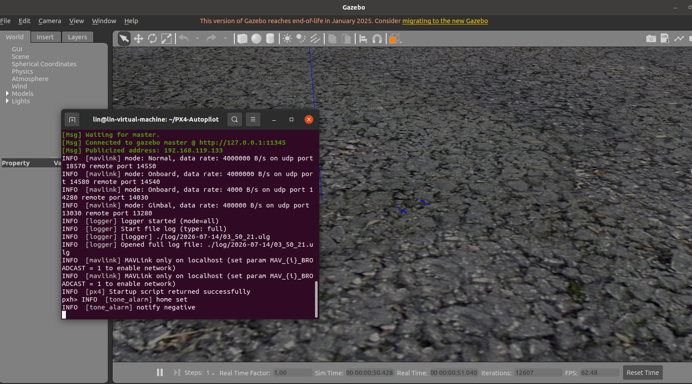

- ?? Livox-SDK2

```text
cd ~
git clone https://github.com/Livox-SDK/Livox-SDK2.git
cd Livox-SDK2

mkdir build
cd build

cmake .. -DCMAKE_BUILD_TYPE=Release
make -j"$(nproc)"
sudo make install
sudo ldconfig
```

??

```text
ldconfig -p | grep livox
```

????? /usr/local/lib ?? Livox SDK ?????????

- ????????????????????

```bash
mkdir -p /home/lin/catkin_ws/src
cd catkin_ws/src
git clone https://github.com/Livox-SDK/livox_ros_driver2.git 
cd livox_ros_driver2
# ????ROS1?????ROS2???????
./build.sh ROS1
# ??????source ../../devel/setup.bash
```

????? rosdep ?????

```text
cd catkin_ws
rosdep install --from-paths src --ignore-src -r -y
```

- ??livox_laser_simulation

```markdown
cd ~/catkin_ws/src
# ??Custom????????????????????Fastlio?????????????????????
git clone https://github.com/linny-tech/Mid360_imu_sim.git
cd ..
catkin_make
# ???~/.bashrc?????????????source devel/setup.bash
```

??????????????bashrc???source /home/.../catkin_ws/devel/setup.bash?

```text
roslaunch livox_laser_simulation livox_simulation.launch
```

?????????????????

```text
rostopic type /scan
```

- ?? MID360 ????????

```bash
cd ~
git clone https://github.com/qiurongcan/Mid360_px4.git

cp -a \
  /home/???????/Mid360_px4/Mid360 \
  /home/???????/PX4-Autopilot/Tools/sitl_gazebo/models/

cp -a \
  /home/???????/Mid360_px4/iris_mid360 \
  /home/???????/PX4-Autopilot/Tools/sitl_gazebo/models/
```

??

```text
ls /home/lin/PX4-Autopilot/Tools/sitl_gazebo/models/Mid360
ls /home/lin/PX4-Autopilot/Tools/sitl_gazebo/models/iris_mid360
```

- ?? MID360 CSV ??????/PX4-Autopilot/Tools/sitl_gazebo/models/Mid360?

?71????????????????????????????38??68?70????????????????????????

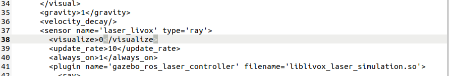


```bash
??????
70          <downsample>1</downsample>
71          <csv_file_name>/home/lin/PX4-Autopilot/Tools/sitl_gazebo/models/Mid360/livox_mid40/scan_mode/mid360.csv</csv_file_name>
72          <ros_topic>/scan</ros_topic>
```

- ??.bashrc????????????????????????????????????????????????????????????

```markdown
# ROS Noetic
if [ -f /opt/ros/noetic/setup.bash ]; then
    source /opt/ros/noetic/setup.bash
fi

# EGO Gazebo workspace
if [ -f /home/??????/ego_gazebo_ws/devel/setup.bash ]; then
    source /home/??????/ego_gazebo_ws/devel/setup.bash
fi

# Main workspace: livox_ros_driver2, MID360 plugin, FAST-LIO
if [ -f /home/??????/catkin_ws/devel/setup.bash ]; then
    source /home/??????/catkin_ws/devel/setup.bash
fi

# PX4 v1.13.3 + Gazebo Classic
if [ -f /home/??????/PX4-Autopilot/Tools/setup_gazebo.bash ]; then
    source /home/??????/PX4-Autopilot/Tools/setup_gazebo.bash \
        /home/??????/PX4-Autopilot \
        /home/??????/PX4-Autopilot/build/px4_sitl_default
fi

# Explicit ROS package roots: restore paths overwritten by catkin setup files
export ROS_PACKAGE_PATH="/home/??????/ego_gazebo_ws/src:/home/??????/catkin_ws/src:/home/lin/PX4-Autopilot:/home/lin/PX4-Autopilot/Tools/sitl_gazebo:/opt/ros/noetic/share"

# Gazebo plugins: PX4 plugins + MID360 simulation plugin
export GAZEBO_PLUGIN_PATH="/home/??????/catkin_ws/devel/lib:/home/??????/PX4-Autopilot/build/px4_sitl_default/build_gazebo:${GAZEBO_PLUGIN_PATH}"

# Shared libraries
export LD_LIBRARY_PATH="/usr/local/lib:/home/??????/catkin_ws/devel/lib:/home/??????/PX4-Autopilot/build/px4_sitl_default/build_gazebo:${LD_LIBRARY_PATH}"

# VMware Gazebo compatibility
export SVGA_VGPU10=0
```

- ???????????????

```bash
rospack find px4
rospack find mavlink_sitl_gazebo
rospack find livox_laser_simulation

echo "$GAZEBO_MODEL_PATH"
echo "$GAZEBO_PLUGIN_PATH"
echo "$LD_LIBRARY_PATH"
```

- ????????? PX4 + MID360

```text
??1
roslaunch px4 mavros_posix_sitl.launch \
  vehicle:=iris \
  sdf:=/home/???????/PX4-Autopilot/Tools/sitl_gazebo/models/iris_mid360/iris_mid360.sdf
```

```text
??2
rostopic type /scan
rostopic hz /scan
rostopic echo /scan
```

?????????mid360????????/scan??????

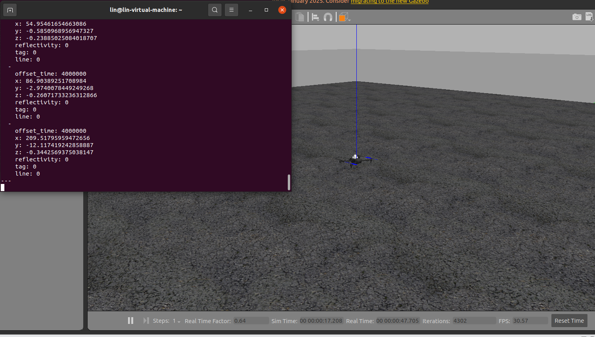

????????????????????ego?????gazebo??

- ???????camera_pose_node    ego_gazebo_worlds  ?????????????

```text
cd catkin_ws/src

git clone https://github.com/linny-tech/ego_gazebo_worlds.git
git clone https://github.com/linny-tech/camera_pose_node.git
```

??????????????mid360???????????

```text
roslaunch ego_gazebo_worlds px4_mid360_ego.launch
```

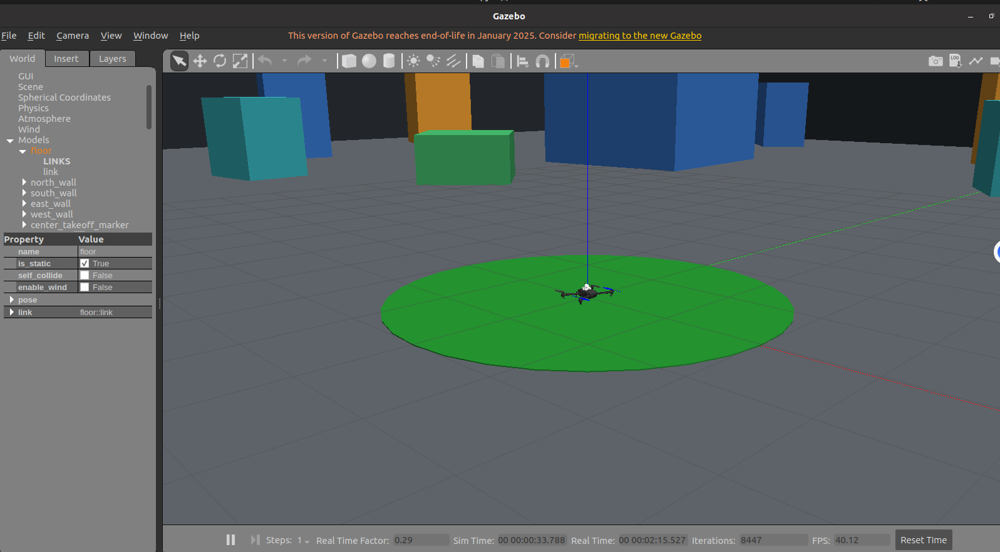

- ??ego???

```text
cd catkin_ws/src
git clone https://github.com/ZJU-FAST-Lab/ego-planner.git

cd ..
catkin_make
```

- ?????????offboard_hover

```text
cd catkin_ws/src
git clone https://github.com/linny-tech/offboard_hover.git
cd ..
catkin_make --pkg offboard_hover
```

- ??fastlio

```text
????
sudo apt update

sudo apt install -y \
    libeigen3-dev \
    libpcl-dev \
    libomp-dev \
    python3-dev \
    ros-noetic-pcl-ros \
    ros-noetic-eigen-conversions
```

```text
cd catkin_ws/src
git clone --recursive https://github.com/hku-mars/FAST_LIO.git
cd FAST_LIO
git submodule update --init --recursive
```

?? livox_ros_driver2

```text
cd catkin_ws/src/FAST_LIO

grep -RIl \
    --exclude-dir=.git \
    'livox_ros_driver' \
    CMakeLists.txt package.xml include src |
xargs -r sed -i 's/livox_ros_driver/livox_ros_driver2/g'
```

```text
????
grep -R "livox_ros_driver2" \
    CMakeLists.txt package.xml include src | head -20
```

?????????

```text
livox_ros_driver2
livox_ros_driver2/CustomMsg.h
livox_ros_driver2::CustomMsg
```

??????????

```text
????????
grep -R "livox_ros_driver/CustomMsg" \
    CMakeLists.txt package.xml include src
```

????????

```text
cd catkin_ws

catkin_make -DCMAKE_BUILD_TYPE=Release
```

??????????????

```text
source ~/.bashrc
rospack profile
rospack find fast_lio
```

- ?? MID360 ????

```bash
FAST_LIO_DIR=$(rospack find fast_lio)

test -f "$FAST_LIO_DIR/config/mid360.yaml" || \
cp "$FAST_LIO_DIR/config/avia.yaml" \
"$FAST_LIO_DIR/config/mid360.yaml"

nano "$FAST_LIO_DIR/config/mid360.yaml"
```

????????

```yaml
common:
    lid_topic: "/scan"
    imu_topic: "/mavros/imu/data"
    time_sync_en: false
    time_offset_lidar_to_imu: 0.0

preprocess:
    lidar_type: 1
    scan_line: 4
    blind: 0.5

mapping:
    acc_cov: 0.1
    gyr_cov: 0.1
    b_acc_cov: 0.0001
    b_gyr_cov: 0.0001
    fov_degree: 360
    det_range: 30.0
    extrinsic_est_en: false
    extrinsic_T: [ -0.005, 0.005, 0.097 ]
    extrinsic_R: [ 1, 0, 0,
                   0, 1, 0,
                   0, 0, 1 ]

publish:
    path_en: true
    scan_publish_en: true
    dense_publish_en: true
    scan_bodyframe_pub_en: true

pcd_save:
    pcd_save_en: false
    interval: -1
```

??????

```text
grep -nE \
'lid_topic|imu_topic|lidar_type|scan_line|blind|extrinsic_T' \
"$FAST_LIO_DIR/config/mid360.yaml"
```

- ????????

```bash
test -f "$FAST_LIO_DIR/launch/mapping_mid360_sim.launch" || \
cp "$FAST_LIO_DIR/launch/mapping_avia.launch" \
"$FAST_LIO_DIR/launch/mapping_mid360_sim.launch"

sed -i 's#config/avia.yaml#config/mid360.yaml#' \
"$FAST_LIO_DIR/launch/mapping_mid360_sim.launch"
```

```text
????config/mid360.yaml
grep rosparam \
"$FAST_LIO_DIR/launch/mapping_mid360_sim.launch"
```

- ??px4??mid360??offbroad???????????????qgc?????????px4????????????????qgc??

- ?????

```text
roslaunch ego_gazebo_worlds px4_mid360_ego.launch
```

????qgc?????????????????qgc?

```text
EKF2_AID_MASK  ???24
EKF2_HGT_MODE  ???vision
COM_RC_IN_MODE ???4
COM_RCL_EXCEPT ???6
```

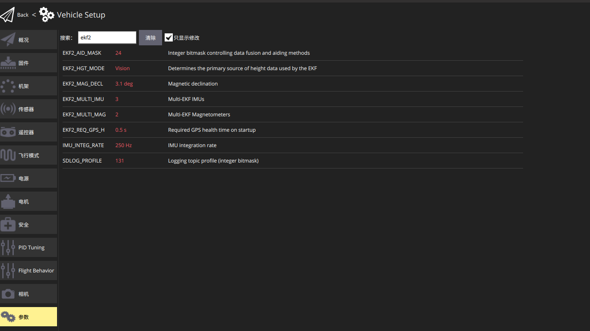


????????????????????????????????????????qgc????????

- ????????????????????????

### **2.????**

#### **?1????????????????**

livox_ros_driver2 ?mid360???

Mid360_imu_sim ?mid360???

FAST_LIO  ???

camera_pose_node  ??fastlio????????px4???????????????????????????

offboard_hover  ???????????1.5m?????offborad??ego????

ego-planner  ?????

ego_gazebo_worlds  ???????????????????50*50*4m????

1.?????  ?????roslaunch ego_gazebo_worlds px4_mid360_ego.launch

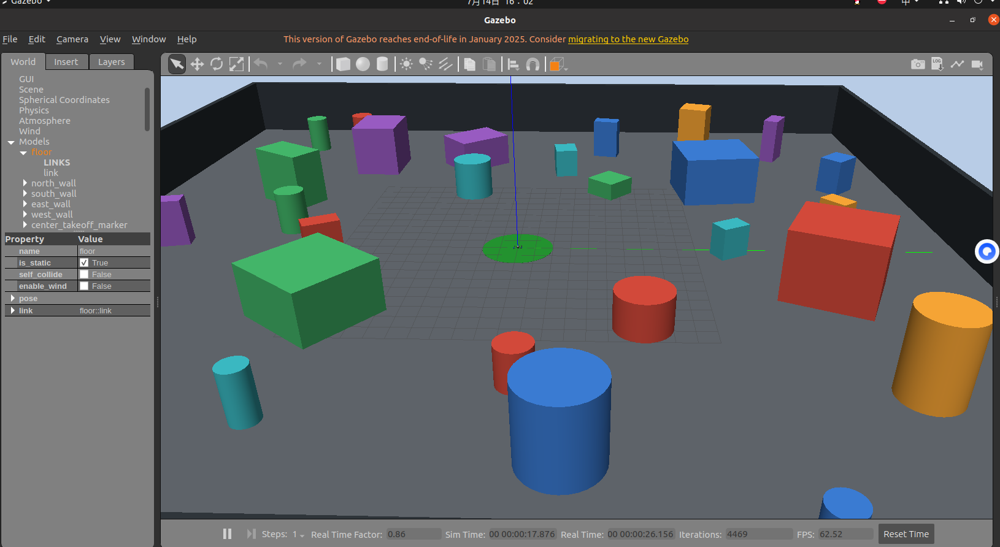

2.????  ?????roslaunch ego_gazebo_worlds px4_mid360_forest.launch

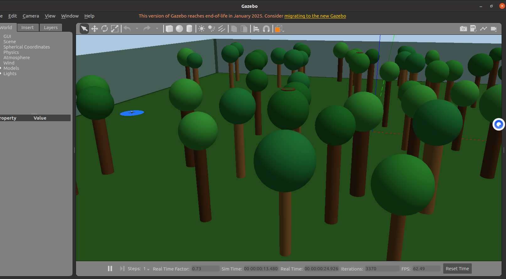

3.????  ?????roslaunch ego_gazebo_worlds px4_mid360_residential.launch

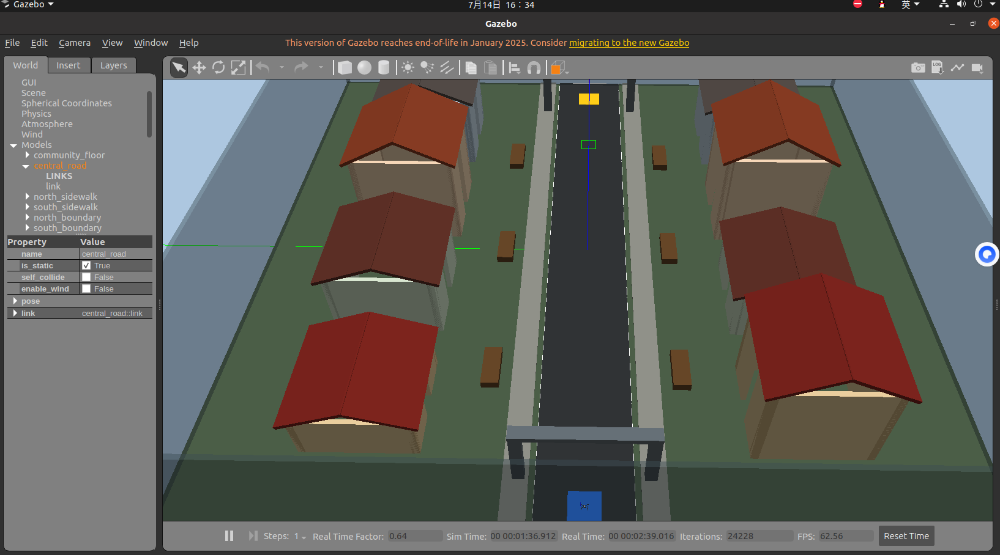

4.??????  ?????roslaunch ego_gazebo_worlds px4_mid360_tunnel.launch

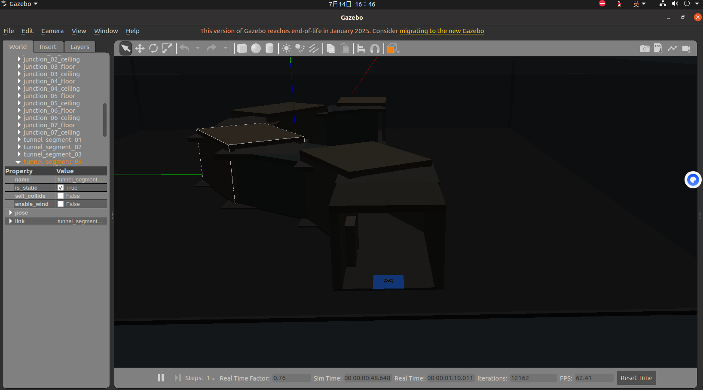

????

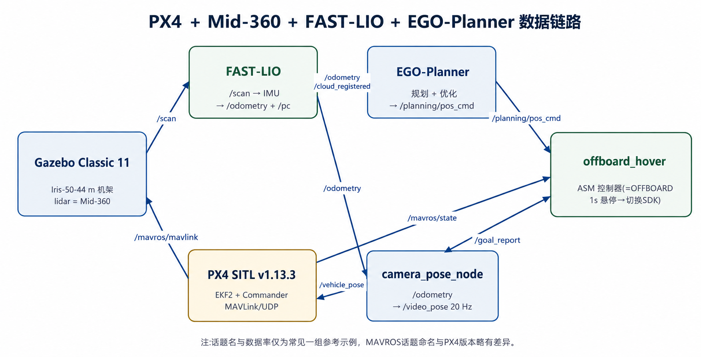

#### **?2????????????ego????????????mid360????????????????**

```text
??????????????
roslaunch ego_gazebo_worlds px4_mid360_ego.launch //??????
roslaunch ego_gazebo_worlds px4_mid360_forest.launch //????
roslaunch ego_gazebo_worlds px4_mid360_residential.launch //????
roslaunch ego_gazebo_worlds px4_mid360_tunnel.launch //????
```


```text
??????????rviz??????????????????????
roslaunch fast_lio mapping_mid360_sim.launch //?rviz?
roslaunch fast_lio mapping_mid360_sim.launch rviz:=false  //?rviz?
```

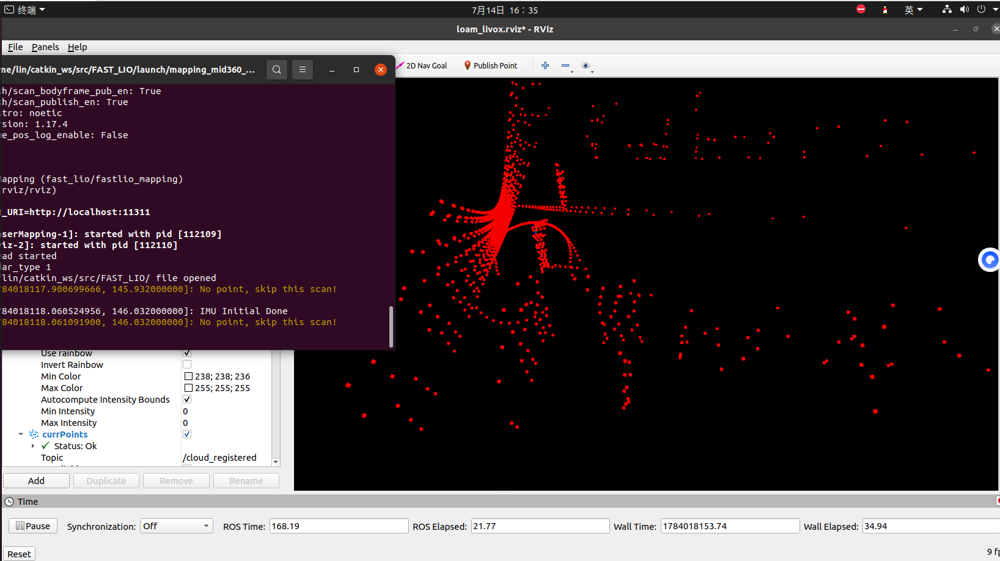

```text
???
roslaunch camera_pose_node pose_tf.launch
```

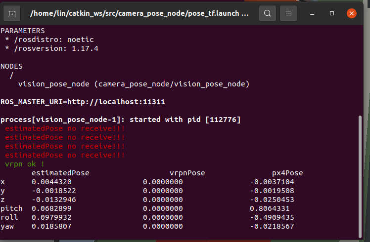

```text
????????????????1.5m??
roslaunch offboard_hover offboard_lidar_hover.launch
```

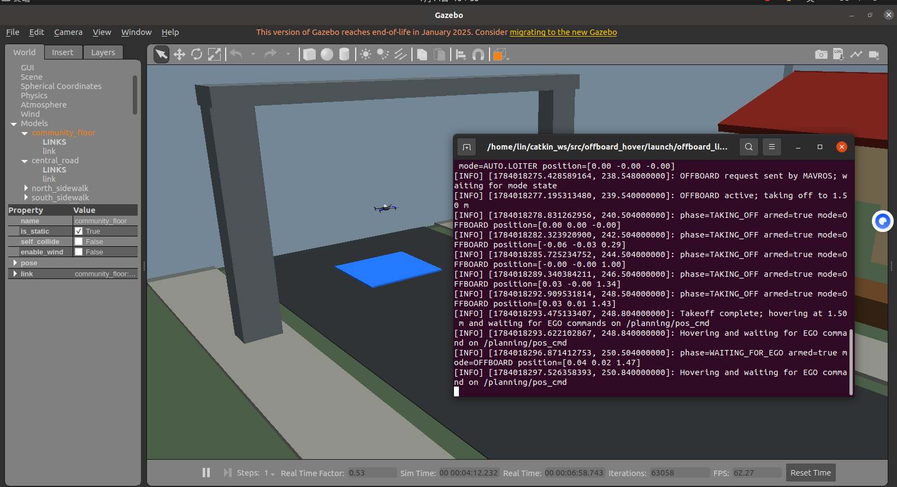

```text
????????????????????????
roslaunch ego_planner run_in_sim.launch
```

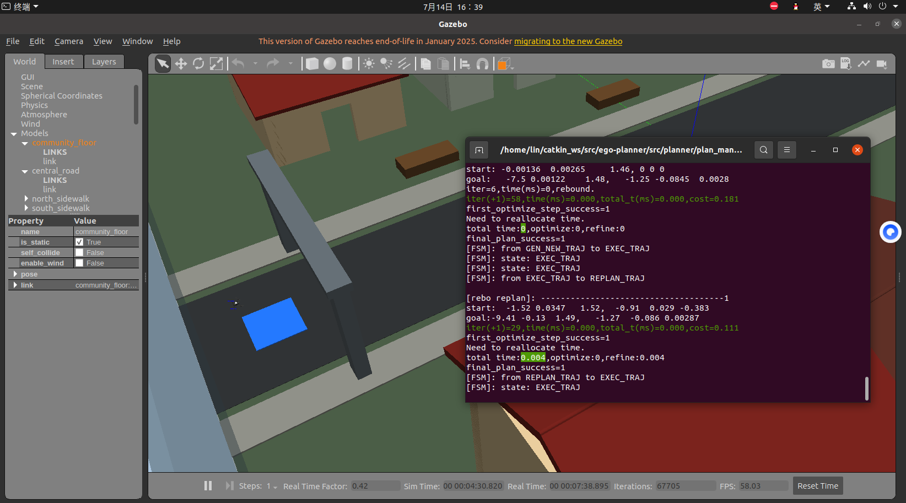

#### **?3??????????**

?????????

```xml
    <arg name="max_vel" value="0.5" />
```

```xml
    <arg name="max_acc" value="0.8" />
```

???????????

a.??????  grid_map/obstacles_inflation

b.??????????  optimization/dist0

c.???????  grid_map/resolution

- **??A?????????  (optimization/dist0=0.5  ???????  grid_map/resolution=0.1)**

<table>
  <tbody>
    <tr>
      <td>A1</td>
      <td>0.1</td>
    </tr>
    <tr>
      <td>A2</td>
      <td>0.2</td>
    </tr>
    <tr>
      <td>A3</td>
      <td>0.3</td>
    </tr>
    <tr>
      <td>A4</td>
      <td>0.4</td>
    </tr>
    <tr>
      <td>A5</td>
      <td>0.5</td>
    </tr>
  </tbody>
</table>

??????????????????

A1:??

**[a2.mp4]**

A2??

**[a3.mp4]**

A3??

**[a4.mp4]**

A4??????

**[a4.mp4]**

A5????????

**[a5.mp4]**

?????????????????????????????????????????????????????????????????????????????????????????

??????????????????  grid_map/obstacles_inflation????????????????????????  optimization/dist0??????????????????

- **??B???????  ( grid_map/obstacles_inflation=0.2    grid_map/resolution=0.1)**

<table>
  <tbody>
    <tr>
      <td>B1</td>
      <td>0.2</td>
    </tr>
    <tr>
      <td>B2</td>
      <td>0.35</td>
    </tr>
    <tr>
      <td>B3</td>
      <td>0.5</td>
    </tr>
    <tr>
      <td>B4</td>
      <td>0.65</td>
    </tr>
    <tr>
      <td>B5</td>
      <td>0.8</td>
    </tr>
  </tbody>
</table>

?????????????

B1 ??

**[b1.mp4]**

B2 ??

**[b2.mp4]**

B3??

**[b3.mp4]**

B4 ???

**[b4.mp4]**

B5  ???

**[b5.mp4]**

????????0.2????0.3-0.5?????0.65?0.85???????????????optimization/dist0??????????????????????????????????????????????????????????????????????????????????????????????

??????????????????????????????????????????????????????grid_map/obstacles_inflation?optimization/dist0?

- **??C????????**

<table>
  <tbody>
    <tr>
      <td>C1</td>
      <td>0.05 </td>
    </tr>
    <tr>
      <td>C2</td>
      <td>0.10</td>
    </tr>
    <tr>
      <td>C3</td>
      <td>0.20</td>
    </tr>
    <tr>
      <td>C4</td>
      <td>0.40</td>
    </tr>
    <tr>
      <td>C5</td>
      <td>0.50</td>
    </tr>
  </tbody>
</table>

???????????????

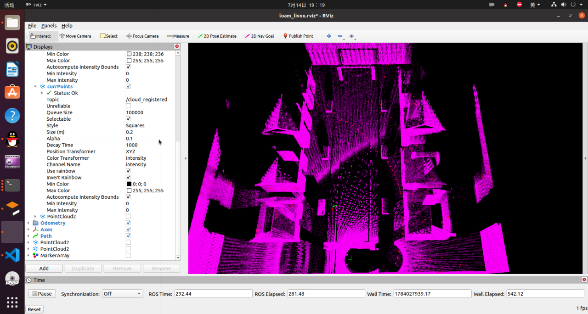

C1  ????????????cpu?????

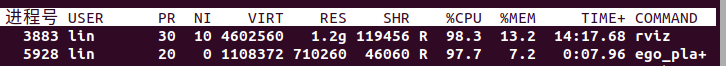

C2 ?????????????cpu?????C3?4?5??????????

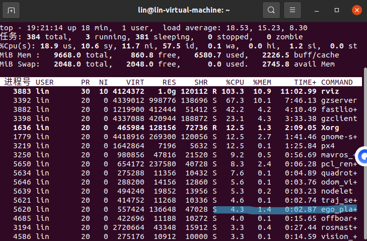

C3 ?????cpu?????

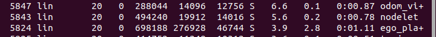

C4?C5?cpu??????????????????????

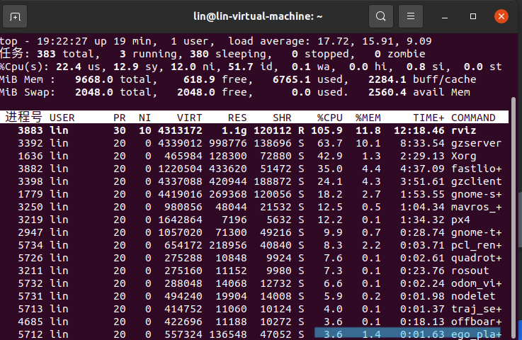

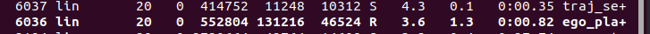

**[c5.mp4]**

????????

0.05 m??????????cpu?????

0.10 m????????????????????????

0.20?0.25 m?????cpu??????

0.4?? cpu?????????????????????

??????????0.1??????

#### **?4???????**

- ????

**[ho.mp4]**

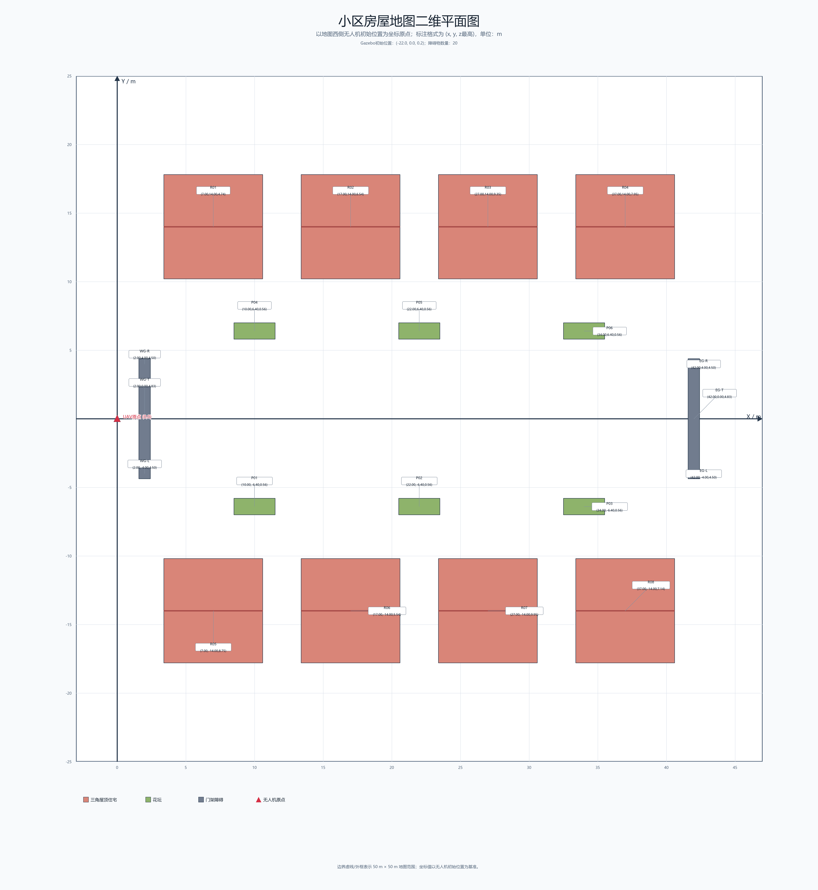

- ???????

**[??1.mp4]**

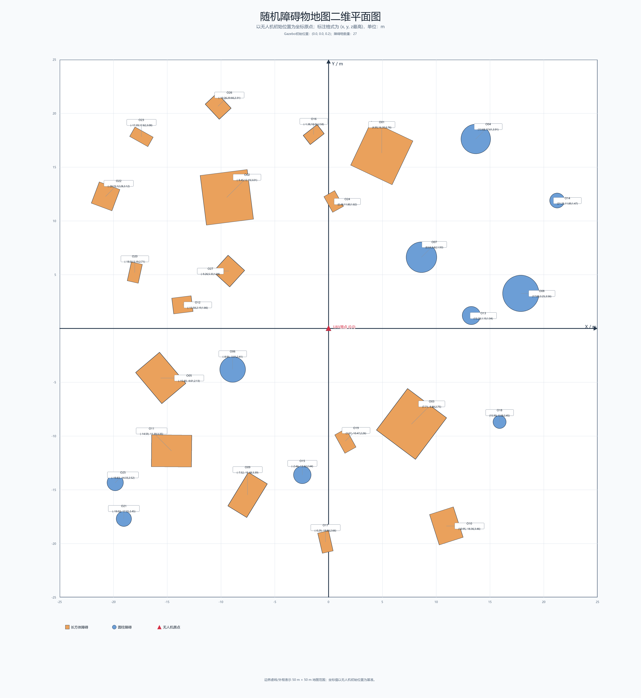

- ????

**[for.mp4]**

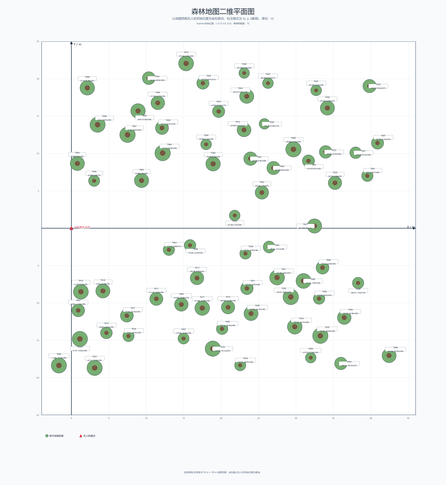

- ????

????????????????
