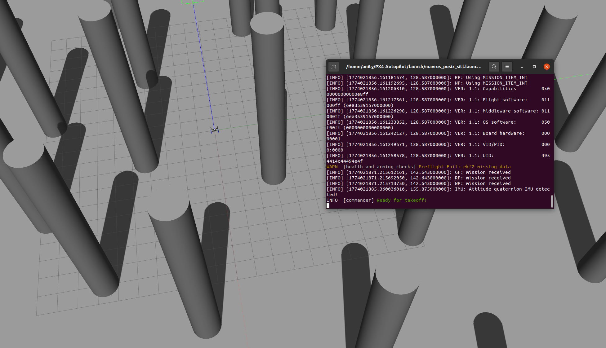
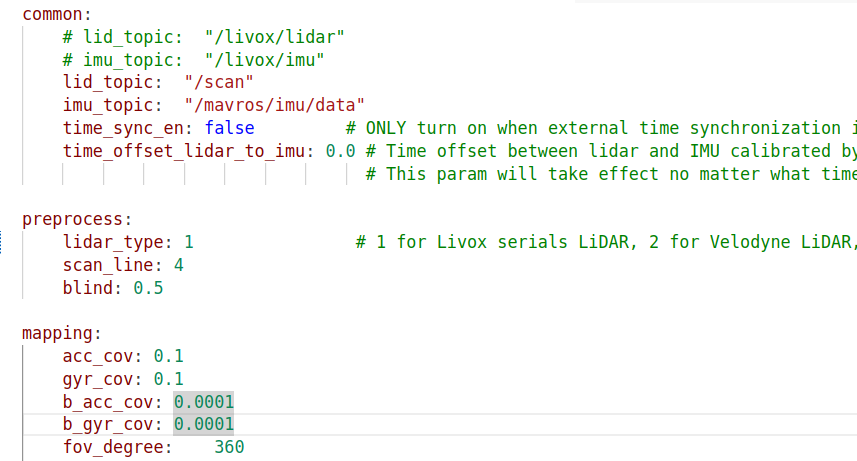
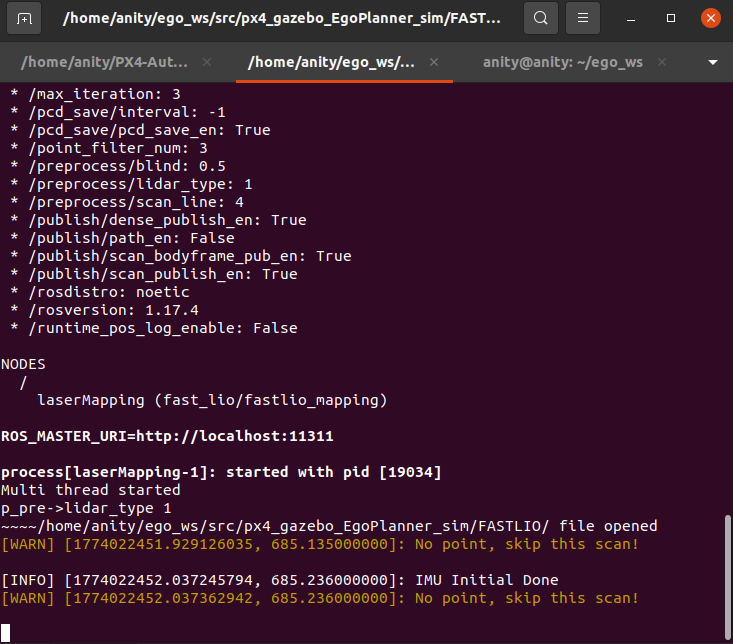
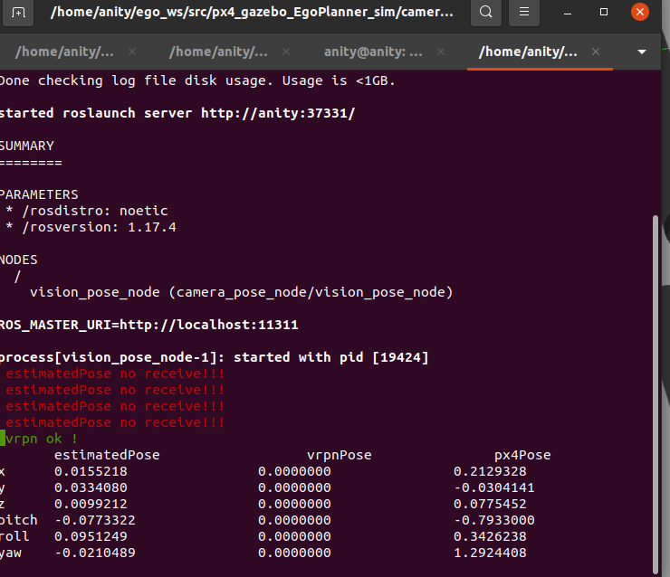
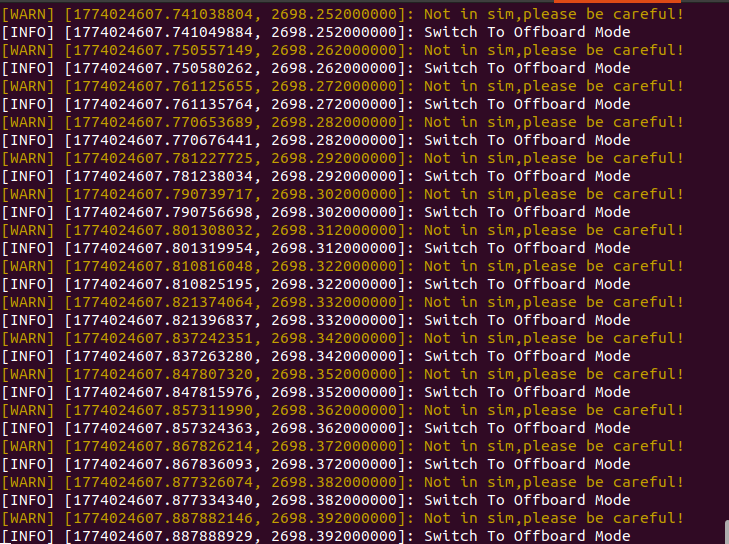
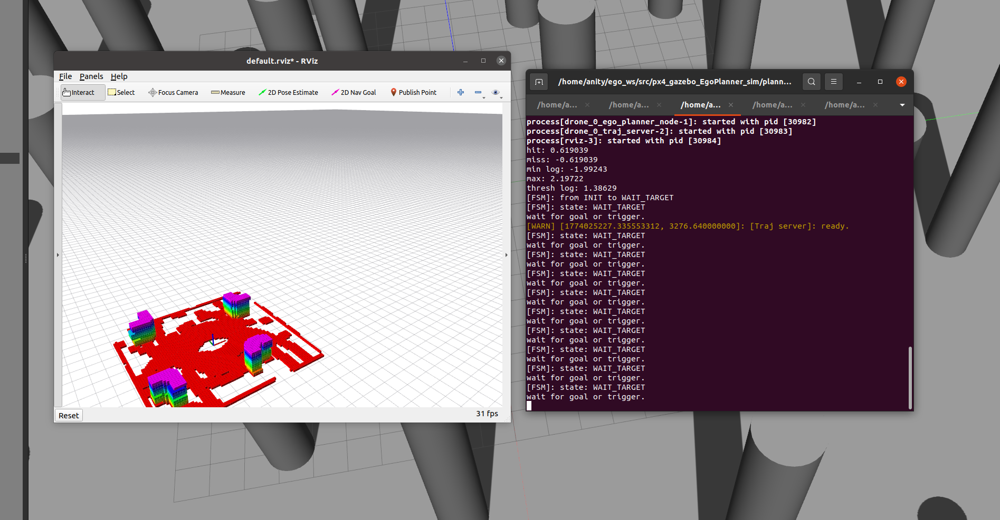
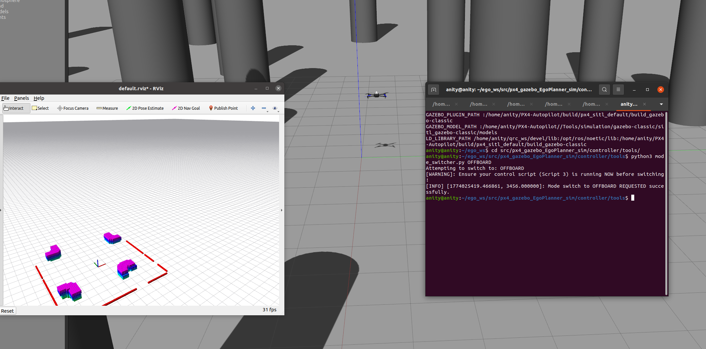
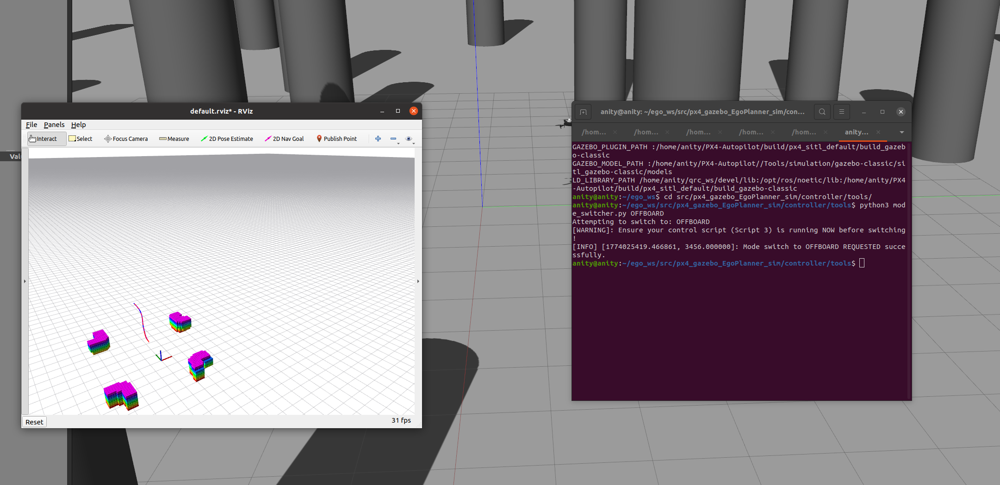
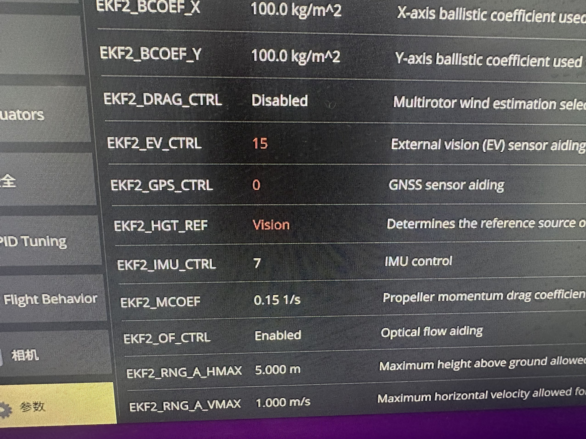

# px4_gazebo_EgoPlanner_sim
egoplanner在gazebo环境下，使用px4无人机和fastlio定位进行仿真，且便于一比一还原至实机部署

|分支|说明|备注|
|---|---|---|
|main|gazebo环境中ego的仿真全套代码||
|real_exp|实机ego实验全套代码配置||


## 仿真环境

| 名称     | 具体版本                                   |
| :------- | :----------------------------------------- |
| 操作系统 | Ubuntu20.04                                |
| ROS      | ROS1 Noetic                                |
| Gazebo   | Gazebo11                                   |
| PX4      | v1.14.0 （这个版本不影响，配置上有略微区别） |
| 传感器   | Mid360                                     |
| 定位算法 | Fast LIO2                                  |
| 路径规划算法 | EgoPlanner                              |
| 控制器  | se3_controller |


## 1 PX4+MID360配置

参考仓库 `https://github.com/qiurongcan/Mid360_px4.git`中的配置方法进行配置，详细阅读，只需要配置mid360不用d435i

**配置完成后**

```shell
# 这里默认无人机型号在`mavros_posix_sitl.launch`文件中替换无人机模型为iris_mid360
roslaunch px4 mavrox_posix_sitl.launch
```

## 2 EgoPlanner配置
egoplanner的实验流程如下
```shell
1 启动gezebo中带mid360的无人机模型
2 FAST LIO 定位
3 fastlio 定位转换 px4 /mavros/vision_pose/pose
4 ego planner 轨迹规划
5 se3 controller 控制器
6 [操作] 代码/遥控器 切换OFFFBOARD模式
7 [操作] rviz选点 / move_base发送点
```

### a 拉取仓库
```shell
cd ~
mkdir -p ego_ws/src
cd ego_ws/src
git clone https://github.com/qiurongcan/px4_gazebo_EgoPlanner_sim.git

```

### b 安装第三方依赖库
```shell
cd ~/ego_ws/src/px4_gazebo_EgoPlanner_sim/
# 1 解压
unzip -d 3rd_part  3rd_party.zip
# 2 安装glog
cd 3rd_part/glog
sh ./autogen.sh
chmod +x configure
./configure
make
sudo make install

# 3 安装ceres
cd 3rd_part/ceres-solver-2.0.0rc1
mkdir build && cd build
cmake ..
sudo make -j4 # 编译的时间可能有点长
sudo make install

# 安装后可以将3rd_part 给删除了
```

### c 编译
```shell
cd ~/ego_ws/
catkin_make_isolated 
# 编译过程中遇到少什么库就安装什么库，这里就布列出来，例如eigen等
# 编译成功后ego_ws目录下会出现 build_isolated  devel_isolated
```

### d 运行代码
**【注意】！！！**可以将`source ~/ego_ws/devel_isolated/setup.bash`添加到`~/.bashrc`中，前提不激活其他工作空间，否则可能会有冲突

#### 1 启动gazebo仿真环境
```shell
# Terminal 1
roslaunch px4 mavros_posix_sitl.launch # 更改模型后的文件
```
启动后看到如下界面，这个world是我自己拉柱子生成的，可以自己画一个world




#### 2 启动fast lio
启动之前检查一下fast_lio 的config设置
在`~/ego_ws/src/px4_gazebo_EgoPlanner_sim/FASTLIO/config/mid360.yaml`文件中，检查`lid_topic`和`imu_topic`
修改为仿真无人机中的话题，如下



配置好后启动fastlio
```shell
# terminal 2
roslaunch fast_lio mapping_mid360.launch
```
启动后会看到如下界面



#### 3 fastlio定位转换给px4
```shell
# Terminal 3
roslaunch camera_pose_node pose_tf.launch
```
启动后会看到如下界面则运行成功



#### 4 启动se3控制器

**注意这个控制器接收ego的话题是`\planning\pos_cmd [quadrotor_msgs::PositionCommand]`**
```shell
# Terminal 4
roslaunch se3_controller sitl_se3_controller.launch
```
启动后会看到如下界面




#### 5 启动egoplanner
启动前可以检查一下`~/ego_ws/src/px4_gazebo_EgoPlanner_sim/planner/plan_manage/launch/single_run_in_exp.launch`配置文件，设置一下几个话题
```xml
6    <arg name="map_size_x" value="100"/> <!-- 地图范围，如果过大运行会报错 -->
7    <arg name="map_size_y" value="50"/>
8    <arg name="map_size_z" value="4.0"/>
9    <arg name="odom_topic" value="/Odometry"/>  <!-- 雷达里程计话题 -->

28   <arg name="cloud_topic" value="/cloud_registered"/>  <!-- 点云话题PointCloud2 -->

35   <arg name="max_vel" value="0.8" /> <!-- 最大飞行速度 -->
36   <arg name="max_acc" value="3.0" /> <!-- 最大飞行加速度 -->

65   <remap from="position_cmd" to="/planning/pos_cmd"/> <!-- ego发布给控制器的话题 -->
```
配置后运行ego
```shell
# Terminal 5
roslaunch ego_planner single_run_in_exp.launch
```
启动后看到如下界面




#### 6 代码切换OFFBOARD模式
```shell
#Terminal 6
cd ~/ego_ws/src/px4_gazebo_EgoPlanner_sim/controller/tools/
python3 mode_switcher.py OFFBOARD
```
会看到无人机起飞至1.5m附近,如下图



#### 7 rviz选点
点击rviz中的`2D Nav Goal`选择一个点
会看到如下结果




**也可以使用rostopic pub的形式**

```shell
rostopic pub /move_base_simple/goal geometry_msgs/PoseStamped "header:
  seq: 0
  stamp:
    secs: 0
    nsecs: 0
  frame_id: ''
pose:
  position:
    x: 10.0
    y: 0.0
    z: 0.0
  orientation:
    x: 0.0
    y: 0.0
    z: 0.0
    w: 0.0" 
```


### d QGC参数设置

**v1.14.0（包括）之后的版本**  

| 参数          | 设置   | 备注                 |
| :------------ | :----- | :------------------- |
| EKF2_HGT_REF  | Vision |                      |
| EKF2_GPS_CTRL | 0      | 有GPS的情况下设置为0 |
| EKF2_EV_CTRL  | 15     |                      |

**如下图所示**


**v1.14.0（不包括)之前的版本**

| 参数          | 设置   |
| :------------ | :----- |
| EKF2_HGT_MODE | Vision |
| EKF2_AID_MASK | 24     |

